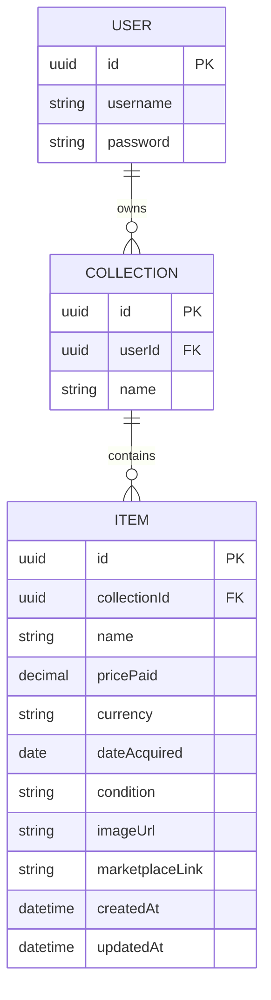

# Pack-Rat — Data Model
 
## Entity Relationship Diagram
 

 
## Entities
 
### User
- `id` — UUID primary key
- `username`
- `password`
Dev/hardcoded login for MVP. Structured so real accounts for friends can be added later without reworking the schema.
 
### Collection
- `id` — UUID primary key
- `userId` — UUID, foreign key to User
- `name`
One-to-many with User: a user can own multiple collections, even though the MVP only creates and displays one. Keeps the door open for use cases like separate collections per TCG later.
 
### Item
- `id` — UUID primary key
- `collectionId` — UUID, foreign key to Collection
- `name`
- `pricePaid` — decimal
- `currency` — ISO code (e.g. CHF, USD, EUR)
- `dateAcquired` — date the item was obtained (user-entered)
- `condition` — fixed set of values (see below)
- `imageUrl` — link to the uploaded (resized/small) picture
- `marketplaceLink` — link to TCGPlayer/Cardmarket for manual current-value lookup
- `createdAt` — when the record was created (system-generated)
- `updatedAt` — when the record was last edited (system-generated)
One-to-many with Collection: each item belongs to exactly one collection.
 
## Fixed value sets
 
### Condition
Standard grading scale, matching common marketplace listings:
- Mint (M)
- Near Mint (NM)
- Excellent (EX)
- Good (GD)
- Light Played (LP)
- Played (PL)
- Poor (PO)
### Currency
Stored as ISO currency codes (e.g. CHF, USD, EUR) rather than symbols, for cleaner future formatting/conversion.
 
## Open decisions
 
- **Total price now** (collection overview) — aggregation logic still to be defined; each item has a marketplace link for manual lookup rather than a stored current-value figure. See GitLab/GitHub issue tracker for details.
