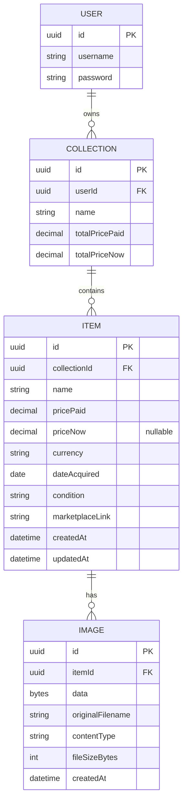

# Pack-Rat — Data Model
 
## Entity Relationship Diagram
 

 
## Entities
 
### User
- `id` — uuid primary key
- `username`
- `password`
Dev/hardcoded login for MVP. Structured so real accounts for friends can be added later without reworking the schema.
 
### Collection
- `id` — uuid primary key
- `userId` — uuid, foreign key to User
- `name`
One-to-many with User: a user can own multiple collections, even though the MVP only creates and displays one. Keeps the door open for use cases like separate collections per TCG later.
 
### Item
- `id` — uuid primary key
- `collectionId` — uuid, foreign key to Collection
- `name`
- `pricePaid` — decimal
- `priceNow` — decimal, nullable; current value, entered manually by the user for now (see ADR-017)
- `currency` — ISO code (e.g. CHF, USD, EUR) — applies to both `pricePaid` and `priceNow`
- `dateAcquired` — date the item was obtained (user-entered)
- `condition` — fixed set of values (see below)
- `marketplaceLink` — link to TCGPlayer/Cardmarket for manual current-value lookup
- `createdAt` — when the record was created (system-generated)
- `updatedAt` — when the record was last edited (system-generated)
One-to-many with Collection: each item belongs to exactly one collection.
 
### Image
- `id` — uuid primary key
- `itemId` — uuid, foreign key to Item
- `data` — the resized image bytes, stored as `bytea` and loaded lazily (ADR-018). Served at `/api/images/{id}`, so no URL or path is stored
- `originalFilename` — the filename as uploaded, for display purposes
- `contentType` — e.g. `image/jpeg`, used for validation and serving
- `fileSizeBytes` — enforces "small size" constraint, useful for debugging storage
- `createdAt` — when the image was uploaded
One-to-many with Item: an item can have multiple images, even though the MVP only ever uploads one. Future-proofs for cases like front/back photos of a card without a schema migration. Deleting an item cascades to its images.
 
## Fixed value sets
 
### Condition
Standard grading scale, matching common marketplace listings:
- Mint (M)
- Near Mint (NM)
- Excellent (EX)
- Good (GD)
- Light Played (LP)
- Played (PL)
- Poor (PO)
### Currency
Stored as ISO currency codes (e.g. CHF, USD, EUR) rather than symbols, for cleaner future formatting/conversion.
 
