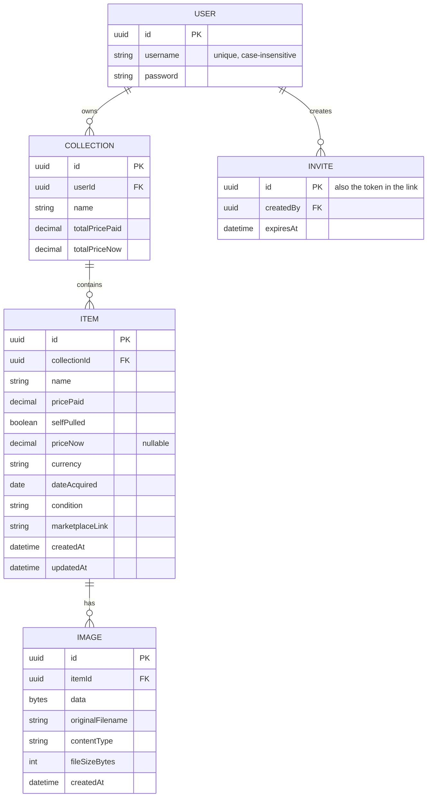

# Pack-Rat — Data Model
 
## Entity Relationship Diagram
 

```mermaid
erDiagram
  USER ||--o{ COLLECTION : owns
  USER ||--o{ INVITE : creates
  COLLECTION ||--o{ ITEM : contains
  ITEM ||--o{ IMAGE : has
  USER {
    uuid id PK
    string username "unique, case-insensitive"
    string password
  }
  INVITE {
    uuid id PK "also the token in the link"
    uuid createdBy FK
    datetime expiresAt
  }
  COLLECTION {
    uuid id PK
    uuid userId FK
    string name
    decimal totalPricePaid
    decimal totalPriceNow
  }
  ITEM {
    uuid id PK
    uuid collectionId FK
    string name
    decimal pricePaid
    boolean selfPulled
    decimal priceNow "nullable"
    string currency
    date dateAcquired
    string condition
    string marketplaceLink
    datetime createdAt
    datetime updatedAt
  }
  IMAGE {
    uuid id PK
    uuid itemId FK
    bytes data
    string originalFilename
    string contentType
    int fileSizeBytes
    datetime createdAt
  }
```
 
## Entities
 
### User
- `id` — uuid primary key
- `username` — 3–32 characters, unique case-insensitively (DB unique constraint)
- `password` — BCrypt hash
Accounts are created through invite links (ADR-021). The `dev` user is only seeded under the `local` profile.

### Invite
- `id` — uuid primary key, also the token in the invite link (unguessable, ADR-002)
- `createdBy` — uuid, foreign key to User
- `expiresAt` — 7 days after creation
Single-use: deleted in the same transaction that creates the new user (ADR-021). Expired invites can stay in the table; they no longer validate.
 
### Collection
- `id` — uuid primary key
- `userId` — uuid, foreign key to User
- `name`
One-to-many with User: a user can own multiple collections, e.g. one per TCG (ADR-003). The overview dashboard shows totals across all of them (ADR-022).
 
### Item
- `id` — uuid primary key
- `collectionId` — uuid, foreign key to Collection
- `name`
- `pricePaid` — decimal, ≥ 0; always 0 when `selfPulled` is true (see ADR-020)
- `selfPulled` — boolean, not null, default false; true if the user pulled the card from a pack themselves rather than buying it
- `priceNow` — decimal, nullable; current value, entered manually by the user for now (see ADR-017)
- `currency` — ISO code (e.g. CHF, USD, EUR) — applies to both `pricePaid` and `priceNow`
- `dateAcquired` — date the item was obtained (user-entered)
- `condition` — fixed set of values (see below)
- `marketplaceLink` — link to TCGPlayer/Cardmarket for manual current-value lookup
- `createdAt` — when the record was created (system-generated)
- `updatedAt` — when the record was last edited (system-generated)
One-to-many with Collection: each item belongs to exactly one collection.
 
### Image
- `id` — uuid primary key
- `itemId` — uuid, foreign key to Item
- `data` — the resized image bytes, stored as `bytea` and loaded lazily (ADR-018). Served at `/api/images/{id}`, so no URL or path is stored
- `originalFilename` — the filename as uploaded, for display purposes
- `contentType` — e.g. `image/jpeg`, used for validation and serving
- `fileSizeBytes` — enforces "small size" constraint, useful for debugging storage
- `createdAt` — when the image was uploaded
One-to-many with Item: an item can have multiple images, even though the MVP only ever uploads one. Future-proofs for cases like front/back photos of a card without a schema migration. Deleting an item cascades to its images.
 
## Fixed value sets
 
### Condition
Standard grading scale, matching common marketplace listings:
- Mint (M)
- Near Mint (NM)
- Excellent (EX)
- Good (GD)
- Light Played (LP)
- Played (PL)
- Poor (PO)
### Currency
Stored as ISO currency codes (e.g. CHF, USD, EUR) rather than symbols, for cleaner future formatting/conversion.
 
