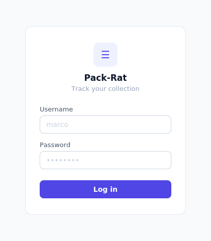
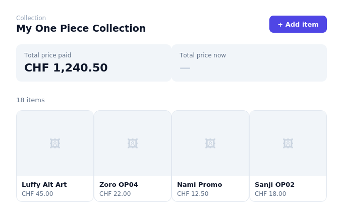
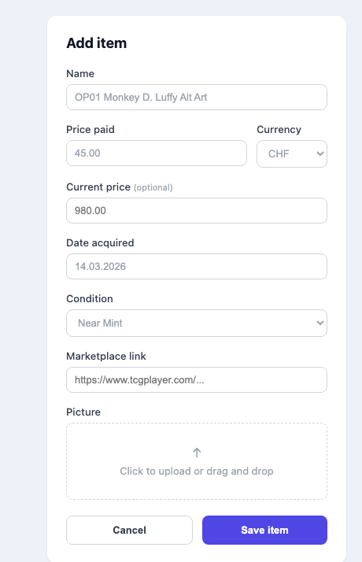
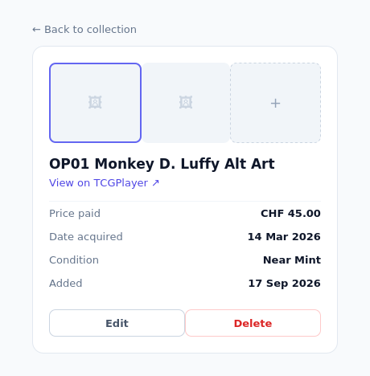

# Pack-Rat — UI Design (rough)

Rough screen layouts agreed on during design discussion, before implementation. These are layout/field references, not final specs — actual styling happens in Angular with Tailwind CSS (see ADR-011).

## 1. Login

- Dev/hardcoded login for MVP
- Fields: username, password
- Centered card on a plain background

## 2. Dashboard (collection overview)

- Header: collection name + "Add item" button
- Two metric cards: total price paid, total price now (sum of each item's manually-entered current price — see ADR-017; shows "—" if no item has one set)
- Item grid: photo-first cards (name + price paid), click through to item detail

## 3. Add item form

- Fields match the finalized data model: name, price paid, current price (optional), currency, date acquired, condition, marketplace link, picture
- Condition is a dropdown of the fixed grading scale (see `data-model.md`)
- Image upload happens as a separate step from item creation (see ADR-008)

## 4. Item detail

- Thumbnail strip at top reflects the `Image` one-to-many relationship (ADR-004) — multiple photos per item, "+" tile to add another
- Detail table: price paid, date acquired, condition, record-created date
- Edit / Delete actions

## Design direction

- Styling approach: Tailwind CSS utility classes (see ADR-011), not a component library like Angular Material
- Visual direction not yet locked — these layouts are about structure and fields, not final colors/typography
