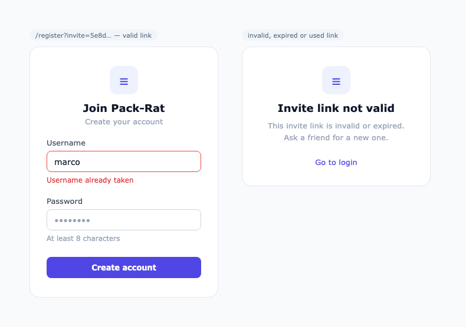
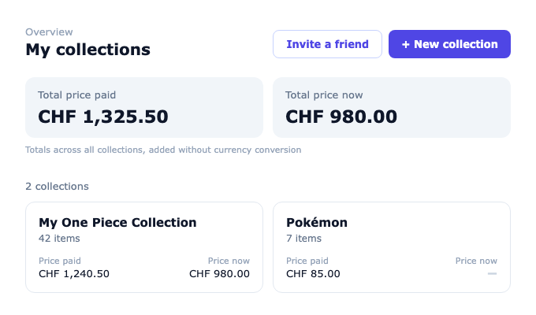

# Pack-Rat — UI Design (rough)

Rough screen layouts agreed on during design discussion, before implementation. These are layout/field references, not final specs — actual styling happens in Angular with Tailwind CSS (see ADR-011).

## 1. Login

- Fields: username, password
- Centered card on a plain background
- No sign-up link: accounts are only created through an invite link (ADR-021, see Register)
- After login: `GET /api/collections` — 0 collections → Create collection, 1 → its Dashboard, 2 or more → Collections overview (ADR-022)

## 2. Register (invite link only)

- Same centered-card layout as Login

- Only reachable through an invite link: `/register?invite=<token>` (ADR-021)
- On load: `GET /api/invites/{token}`
  - `404` or no token → the card only shows "This invite link is invalid or expired. Ask a friend for a new one." with a link to Login
  - `200` → the form
- Fields: username, password
- Client-side validation matching the backend: username 3–32 characters, password at least 8
- Submit → `POST /api/auth/register` → logged in → Create collection (a new user has none)
- Errors inline: "Username already taken" (409) under the username field; "invalid or expired" (404) switches to the dead-link message

## 3. Create collection

- Shown automatically when the user has no collection yet, and reachable from the "New collection" action on the Dashboard and the Collections overview (ADR-022)
- Same centered-card layout as Login
- Field: collection name; submit → `POST /api/collections` → the new collection's Dashboard
- When opened from "New collection", a Cancel link returns to where the user came from

## 4. Collections overview (2 or more collections)

- Same structure as the Dashboard, with collection tiles instead of item tiles

- Landing screen after login once a user has 2 or more collections (ADR-022)
- Data: `GET /api/collections` only — one request, totals per collection included
- Header: "My collections" + "New collection" button + "Invite a friend" button
- Two metric cards: total price paid and total price now across all collections, summed on the client. Price now shows "—" if no collection has one set. Amounts are added without currency conversion (ADR-006)
- Collection grid: one tile per collection (name, item count, price paid, price now), click → that collection's Dashboard

## 5. Dashboard (one collection)

- Header: collection name + "Add item" button + "New collection" button + "Invite a friend" button
- With 2 or more collections: a "← All collections" link above the header, back to the Collections overview
- Two metric cards: total price paid, total price now (sum of each item's manually-entered current price — see ADR-017; shows "—" if no item has one set)
- Item grid: photo-first cards (name + price paid), click through to item detail

### Invite a friend (dialog)

- Opened from the "Invite a friend" button on the Dashboard or Collections overview
- Calls `POST /api/invites` and shows the link with a "Copy link" button and its expiry ("Valid until 9 Oct, works once")
- Each open creates a new invite; closing the dialog doesn't revoke it

## 6. Add item form

- Fields match the finalized data model: name, self-pulled, price paid, current price (optional), currency, date acquired, condition, marketplace link, picture
- Condition is a dropdown of the fixed grading scale (see `data-model.md`)
- Image upload happens as a separate step from item creation (see ADR-008)
- "Self-pulled" checkbox: when ticked, price paid is set to 0 and disabled; unticking re-enables it (see ADR-020)

## 7. Item detail

- Thumbnail strip at top reflects the `Image` one-to-many relationship (ADR-004) — multiple photos per item, "+" tile to add another
- Detail table: price paid, date acquired, condition, record-created date
- Edit / Delete actions

## Design direction

- Styling approach: Tailwind CSS utility classes (see ADR-011), not a component library like Angular Material
- Visual direction not yet locked — these layouts are about structure and fields, not final colors/typography
